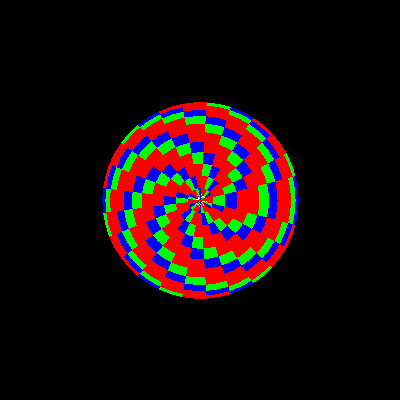

# Sphere Rendering Animation



This repository contains Go code to generate an animated GIF of a rotating sphere rendered with simple 3D graphics techniques.

### Features:
- Sphere Generation: The code generates a sphere by approximating it with triangles. The sphere can be customized by adjusting the number of latitudes and longitudes.
- 3D Rendering: Utilizes simple 3D rendering techniques including perspective projection, shading based on the angle between the normal vector and the view vector, and z-buffering.
- Animation: Creates an animated GIF of the rotating sphere.

### Instructions:
1. Install Go: Make sure you have Go installed on your system. You can download it [here](https://go.dev/dl/).
2. Clone the Repository:
```bash
git clone https://github.com/bagasdisini/go-renderer.git
```
3. Navigate to the Directory:
```bash
cd go-renderer
```
4. Run the Code:
```bash
go run main.go
```
5. Output:
The animated GIF named sphere.gif will be generated in the same directory.

### Customization:
You can customize the sphere by adjusting the parameters in the main.go file:
- latitudes and longitudes: Control the smoothness of the sphere by changing the number of latitudes and longitudes.
- width and height: Set the dimensions of the output GIF.
- Colors: You can adjust the colors of the sphere segments by modifying the color.RGBA values in the code.

Feel free to experiment with the parameters to create different variations of the sphere animation!

### Technologies:
- Go

Enjoy rendering your own animated spheres! 🌐✨